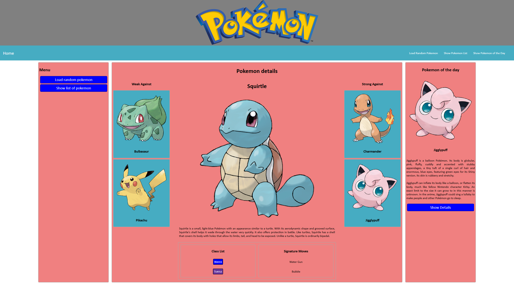
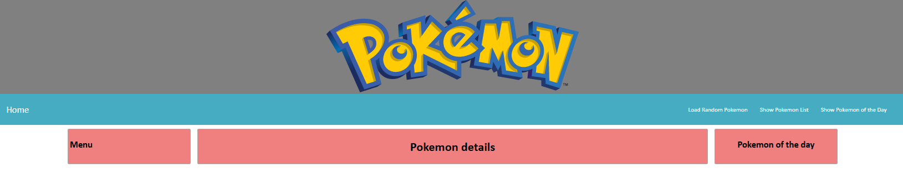
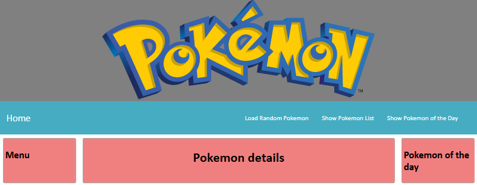
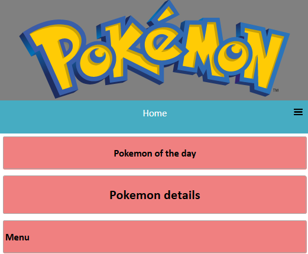
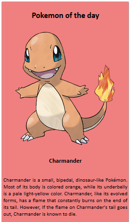
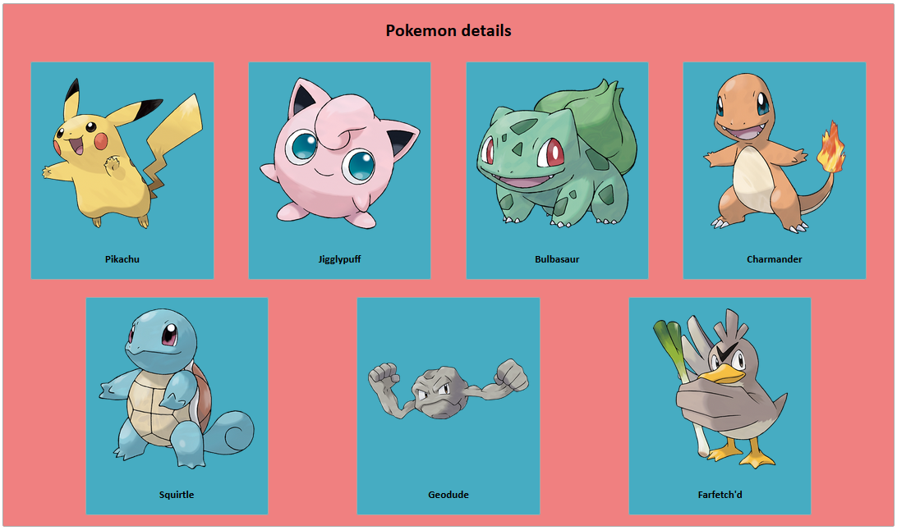
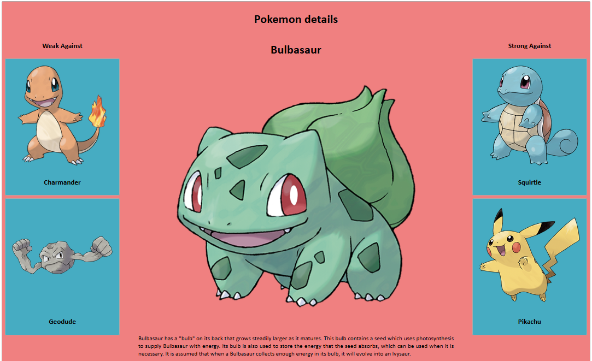
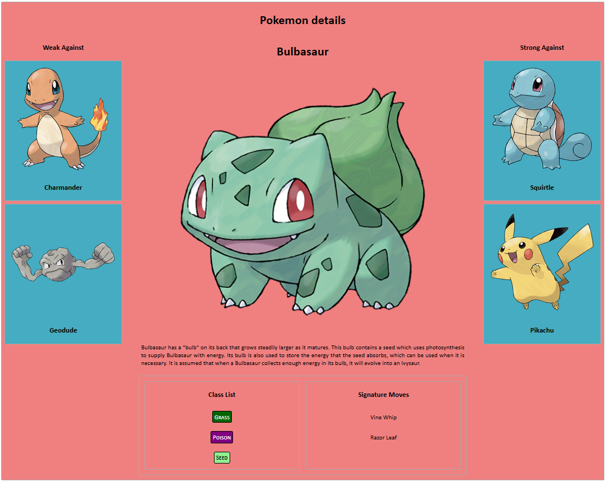

Web Assignment
==============

This assignment will be marked using **Google Chrome** to view your solution. Please test your solutions in Google Chrome before submitting. 

When complete, zip your IntelliJ project for the assignment, including all the source files; then submit your single zip file through Moodle/Canvas before the due date.

Part 1 (10 Marks)
------

In this question, you’ll use a combination of CSS grid, flexbox and medai queries to develop a website for a popular anime / video game franchise. When you’re done with this part, your website should be similar to the screenshot below (it doesn’t need to be a 100% match).

To answer this question, you’ll be writing your HTML code in the `part1/pokemon.html`, `part1/pokemon.js`, and `part1/pokemon.css` files. The CSS and JavaScript files have been included into the HTML file for you, and a number of custom properties have been defined inside the CSS file to guide you with colors and spacings. Refer to the examples given in `web_lab_05` for the required HTML and CSS for creating a responsive menubar.

+ At the top of the page, create a grey region spanning the full-width of the page that has a centered Pokemon logo. The logo image [can be found here.](https://trex-sandwich.com/pokesignment/img/logo.svg).

+ Beneath the logo, insert a full width navigation bar with 4 entries. Aligned to the left of the navbar should be the text "Home", and aligned to the right should be the entries "Load Random Pokemon", "Show Pokemon List" and "Show Pokemon of the Day". The left-aligned entry should be in larger text than those shown on the right. When the "Home" entry is clicked, it should redirect the user to the [Pokemon website](https://www.pokemon.com).

+ Next, 3 columns should appear. The central column should be four times larger than either of the left or right hand columns. The left and right hand columns should have the same width. To the left and right of this content there should be some whitespace. In the left-hand column, add the text "Menu"; in the central column the text "Pokemon details"; and in the right-hand column "Pokemon of the day".

Preview your page and ensure that everything at this stage looks good. It should look something like this.

Extend your CSS so that when the width of the page drops below `1000px`, the whitespace on the left and right hand of the column area disappears. When previewed at this size, the page should look something like the screenshot below.

Continue to modify your CSS so that when the width of the page drops below `900px`, the central 3-column layout transforms into a full width 3-row layout, with te "Pokemon of the Day" area directly under the navbar, followed by the "Pokemon details" region; then finally the "Menu" area. If necessary, modify your navbar code so that at this size it appears as a mobile-friendly "Hamburger" navigation bar. When previewed at this size, the page should look something like the screenshot below.

Part 2 (10 Marks)
------

Make a copy of your `part1` directory and contents, naming the new folder `part2`. Close all open editors and reopen files from the `part2` directory as needed.

In this question you will extend your solution to contain some live content using JavaScript and AJAX. You will be interacting with one of the endpoints found at [https://trex-sandwich.com/pokesignment/](https://trex-sandwich.com/pokesignment/). Read the information found at this link to identify the appropriate endpoint(s) to use to solve the task below.

Add JavaScript that causes the column titled "Pokemon of the Day" to be populated with data about a random Pokemon when the page has finished loading. Specifically, the column should be modified to include an image of the randomly chosen Pokemon, the name of the Pokemon, and a block of text that gives a description of the Pokemon. Images for Pokemon can be found by retrieving the `image` property of an endpoint response, and appending the value to the address [https://trex-sandwich.com/pokesignment/img/](https://trex-sandwich.com/pokesignment/img/). After some Pokemon details have been loaded, the column should look something like the following:

Extend your code so that when the image shown in the "Pokemon of the Day" column is clicked, the panel is refreshed with a new randomly selected Pokemon details.

Part 3 (20 Marks)
------

Make a copy of your `part2` directory and contents, naming the new folder `part3`. Close all open editors and reopen files from the `part3` directory as needed.

Again in this question you will extend your previous code so that, using JavaScript and AJAX, the center column of the page will be populated with data retrieved from the [https://trex-sandwich.com/pokesignment/](https://trex-sandwich.com/pokesignment/) endpoints. 

Add JavaScript that causes the column titled "Pokemon details" to be filled with a collection of clickable panels. Each of these panels will contain a picture of a Pokemon, along with the Pokemon's name. When designing your solution, keep in mind that the number of clickable panels to be displayed will depend on how many Pokemon the service knows about, and this may change in the future! When complete, your central column may look something like the following screenshot.

Update your clickable panels so that when one is clicked, the contents of the "Pokemon details" column is replaced with a detailed view about the clicked Pokemon. This should be made up of a large central area, containing the name and image of the selected Pokemon, as well as a description of it. Flanking this central information should be clickable panels showing the names and images of Pokemon that the selected Pokemon is strong or weak against. 

These clickable panels should exhibit the same behaviours as the other clickable panels you have created - notably, if they are clicked the center panel should update to show the details of the clicked Pokemon.

When complete, the central panel should look something like this.

Part 4 (10 Marks)
------

Make a copy of your `part3` directory and contents, naming the new folder `part4`. Close all open editors and reopen files from the `part4` directory as needed.

When populating the details of Pokemon in the previous part, you may have noticed a few extra properties in the endpoint responses that were not used - the `classes` and `signature_skills`. You will now modify your code so that when a Pokemon is shown in detail, these properties are also displayed. When complete, your central column will look like this when showing the details of one Pokemon.

The signature skills of a Pokemon can be retrieved directly from the server response, but the class list requires an extra step - the coloring. The `keyword` endpoint can be provided with a class keyword, and it will respond with a `background` and `foreground` color to use. For each class keyword that accompanies a Pokemon record, retrieve and use the colors from the endpoint to style the keyword when displaying it in the central column.

Part 5 (10 Marks)
------

Make a copy of your `part4` directory and contents, naming the new folder `part5`. Close all open editors and reopen files from the `part5` directory as needed.

In the "Menu" column, create two new buttons labelled "Load Random Pokemon" and "Show list of Pokemon". At the end of the "Pokemon of the Day" column, create a new button labelled "Show Details". 

Wire up click events on these buttons so that:
+ If the "Load Random Pokemon" button in the menu column, or in the navbar is clicked
  - The central column will display the detail view for a randomly selected Pokemon
+ If the "Show list of Pokemon" button in the menu column, or in the navbar is clicked
  - The central column will display the collection of clickable panels for each available Pokemon, as displayed in the first part of Part 3
+ If the "Show Details" button in the Pokemon of the Day column, or the "Show Pokemon of the Day" entry in the navbar is clicked
  - The central column will display the detail view for the Pokemon that is currently shown in the "Pokemon of the Day" panel.
  
With these buttons added, the basic page layout and appearance should be complete, and will look something like this.

Part 6 (5 Marks)
------

Make a copy of your `part5` directory and contents, naming the new folder `part6`. Close all open editors and reopen files from the `part6` directory as needed.

The colors, fonts and alignments of items in screenshots were chosen for the purpose of showing the layout of the target web page and were not chosen for their beauty. Make changes to your website styles so that the page looks good to your eye. Aim to make the page clear and easy to read, modifying margins, paddings, colors, borders, and fonts; but keep the general page structure shown throughout the screenshots.

Almost certainly you will find that you CSS and JavaScript has gotten a little long-winded and unruly over the course of developing this page. Revisit your JavaScript and CSS and optimize it to remove duplicated rules and code. Approaches that could be used could include:
+ Grouping CSS selectors so that common rules are applied in a single block
+ Use CSS Custom Properties to extract common CSS values
+ Create JavaScript functions that perform common tasks

Grades for this question will be awarded based on the effort put in. If it is clear that you have made reasonable changes between the previous part and this one, you will receive a good mark.

Part 7 (5 Marks)
------

Make a copy of your `part6` directory and contents, naming the new folder `part7`. Close all open editors and reopen files from the `part7` directory as needed.

Currently our Pokemon page reloads each time we refresh the page - showing a new Pokemon of the day and restoring the central panel to showing a list of available Pokemon. This is not particularly user friendly, and it would be nice to be able to pick back where we left off. 

[Using Web Storage APIs](https://developer.mozilla.org/en-US/docs/Web/API/Web_Storage_API), modify your webpage so that the contents of the central panel is remembered when the page is refreshed, and the same content is displayed rather than always displaying the Pokemon list. You will need to remember whether the list view, or Pokemon details view was being show,; and specifically which Pokemon was being viewed in the details pane if it was active.

Further extend your storage solution so that the Pokemon of the Day is remembered, and is only updated when triggered manually by the user (when they click on the random image), or 4 hours after the last random Pokemon has been retrieved. This will involve remembering and updating a `last updated` time value and comparing it against the current time to determine whether the random Pokemon should be updated or not. 